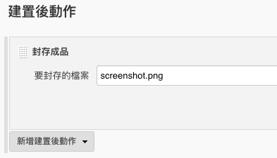

# 實作：PhantomJS

建立 `phantomjs` 新任務。


先檢查是否已安裝 `phantomjs`，如果尚未安裝，則使用 `apt-get`加裝。

```bash
if ! hash phantomjs 2>/dev/null
then
    echo "'phantomjs' was not found in PATH"
    sudo apt-get install phantomjs
fi
```

讓 `jenkins`可以使用`sudo`切換 super user 權限的關鍵，包括：

1. `jenkins` 使用者必須加至 `sudo` 群組 `/etc/group`
2. `sudo` 群組必須設定為「免密碼」 `/etc/sudoers`

如此才能讓 Jenkins 執行 Script 時，可以透過 `sudo` 切換為系統管理者的 root 最高權限。


讓系統使用者可以免密碼使用 sudo 可能帶來的資安風險。


### 擷取網站畫面

使用 GitHub 的 Gist 撰寫一段 PhantomJS 擷取網站畫面的 Script 程式，並命名為 `screenshot.js`。

Create a new Gist - [https://gist.github.com/](https://gist.github.com/)

```javascript
var system = require('system');
var url = system.args[1];
var filename = system.args[2];
var page = new WebPage();

page.viewportSize = {
  width: 1920,
  height: 1080
};

page.clipRect = {
  top: 0,
  left: 0,
  width: 1920,
  height: 1080
};

page.settings.userAgent = 'Mozilla/5.0 (Macintosh; Intel Mac OS X 10_12_6) AppleWebKit/537.36 (KHTML, like Gecko) Chrome/65.0.3325.181 Safari/537.36';

page.open(url, function (status) {
  page.render(filename);
  phantom.exit();
});
```


點選程式碼區塊右上角的「Raw」取得檔案下載網址。

```text
https://gist.githubusercontent.com/lyhcode/6d7e8d0748333bbb0ae7bc1913f97e4d/raw/46af46f3bf804f8dc4d15277114e0013ebac4c16/screenshot.js
```

建置「執行 Shell」的指令範例：

```bash
if ! hash phantomjs 2>/dev/null
then
    echo "'phantomjs' was not found in PATH"
    sudo apt-get install phantomjs
fi

wget -O screenshot.js https://gist.githubusercontent.com/lyhcode/6d7e8d0748333bbb0ae7bc1913f97e4d/raw/da5470678c40fff8e436692f6f3e9bfe73adb4e4/screenshot.js

export QT_QPA_PLATFORM=offscreen

phantomjs screenshot.js $TARGET_URL screenshot.png
```

建置後封存 `screenshot.png`檔案。




